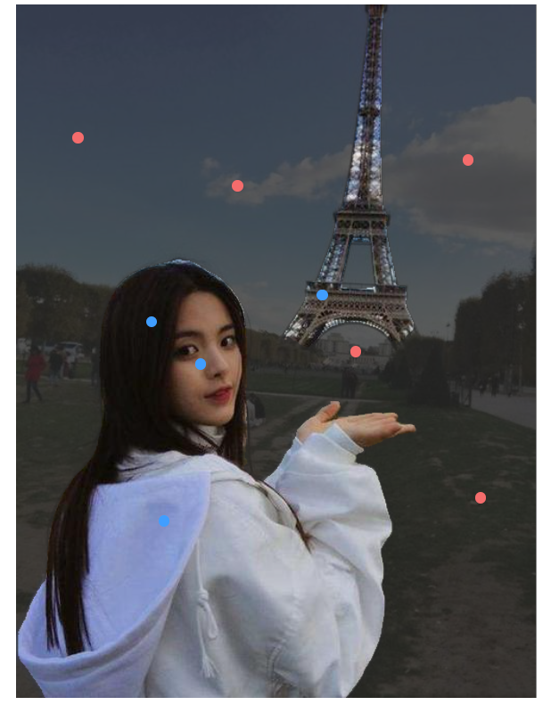

## 一、效果&准备工作

### 1.效果

没啥好说的，低质量复刻SAM官网 https://segment-anything.com/

需要提一点：**所有生成embedding和mask的操作都是python后端做的**，计算mask不是onnxruntime-web实现的，前端只负责了把rle编码的mask解码后画到canvas上，会有几十毫秒的网络传输延迟。我不会react和typescript，官网F12里的源代码太难懂了，生成的svg总是与期望的不一样

#### 主页


#### 鼠标移动动态分割（Hover）

throttle了一下，修改代码里的throttle delay，反应更快些，我觉得没必要已经够了，设置的150ms


#### 点选前景背景（Click）

蓝色前景，红色背景，对应clickType分别为1和0



#### 分割（Cut out object）

同官网，分割出该区域需要的最小矩形框部分


#### 分割所有（Everything）


### 2.准备工作

#### 安装依赖

前端使用了Vue3+ElementPlus（https://element-plus.org/zh-CN/#/zh-CN）+axios+lz-string

后端是fastapi（https://fastapi.tiangolo.com/），FastAPI 依赖 Python 3.8 及更高版本

安装 FastAPI 

```bash
pip install fastapi
pip install "uvicorn[standard]"
```


## 二、后端

### 1.SAM下载

后端基于SAM的代码 https://github.com/facebookresearch/segment-anything

需要自行下载模型文件，保存到后端目录/checkpoints中

- **`default` or `vit_h`: [ViT-H SAM model.](https://dl.fbaipublicfiles.com/segment_anything/sam_vit_h_4b8939.pth)**
- `vit_l`: [ViT-L SAM model.](https://dl.fbaipublicfiles.com/segment_anything/sam_vit_l_0b3195.pth)
- `vit_b`: [ViT-B SAM model.](https://dl.fbaipublicfiles.com/segment_anything/sam_vit_b_01ec64.pth)


### 2.启动

在cmd或者pycharm终端，cd到后端根目录下，输入uvicorn main:app --port 8006，启动服务器


## 三、代码说明

- 由于pycocotools的rle encode是从上到下进行统计连续的0和1，为了方便，我在【@/util/mask_utils.js:decodeRleCounts】解码Click点选产生的mask时将（H，W）的矩阵转成了（W，H）顺序存储的Uint8array；而在Everything分割所有时，我没有使用pycocotools的encode，而是main.py中的my_compress函数编码的，是从左到右进行压缩，因此矩阵解码后仍然是（H，W）的矩阵，所以在**drawCanvas**和**drawEverythingCanvas**中的二层循环xy的顺序不一样，我实在懒得改了，就这样就可以了。

关于上面所提rle，可以在SAM官方项目根目录/notebooks/predictor_example.ipynb中产生mask的位置添加代码自行观察他编码的rle，他只支持矩阵元素为0或1，result的第一个位置是0的个数，不管矩阵是不是0开头。

- `[0,0,1,1,0,1,0]`，rle counts是[2（两个0）, 2（两个1）, 1（一个0）, 1（一个1）, 1（一个0）]；

- `[1,1,1,1,1,0]`，rle counts是[0（零个0）,5（五个1）,1（一个0）]

```python
def decode_rle(rle_string): # 这是将pycocotools的counts编码的字符串转成counts数组，而非转成原矩阵
    result = []
    char_index = 0
    
    while char_index < len(rle_string):
        value = 0
        k = 0
        more = 1
        
        while more:
            c = ord(rle_string[char_index]) - 48
            value |= (c & 0x1f) << (5 * k)
            more = c & 0x20
            char_index += 1
            k += 1
            if not more and c & 0x10:
                value |= -1 << (5 * k)
        
        if len(result) > 2:
            value += result[-2]
        result.append(value)
    return result

from pycocotools import mask as mask_utils
import numpy as np
mask = np.array([[1,1,0,1,1,0],[1,1,1,1,1,1],[0,1,1,1,0,0],[1,1,1,1,1,1]])
mask = np.asfortranarray(mask, dtype=np.uint8)
print("原mask：\n{}".format(mask))
res = mask_utils.encode(mask)
print("encode：{}".format(res))
print("rle counts：{}".format(decode_rle(res["counts"].decode("utf-8"))))
# 转置后好看
print("转置：{}".format(mask.transpose()))
# flatten后更好看
print("flatten：{}".format(mask.transpose().flatten()))
#numpy_array = np.frombuffer(res["counts"], dtype=np.uint8)
# 打印numpy数组作为uint8array的格式
#print("Uint8Array([" + ", ".join(map(str, numpy_array)) + "])")
```

输出：

 